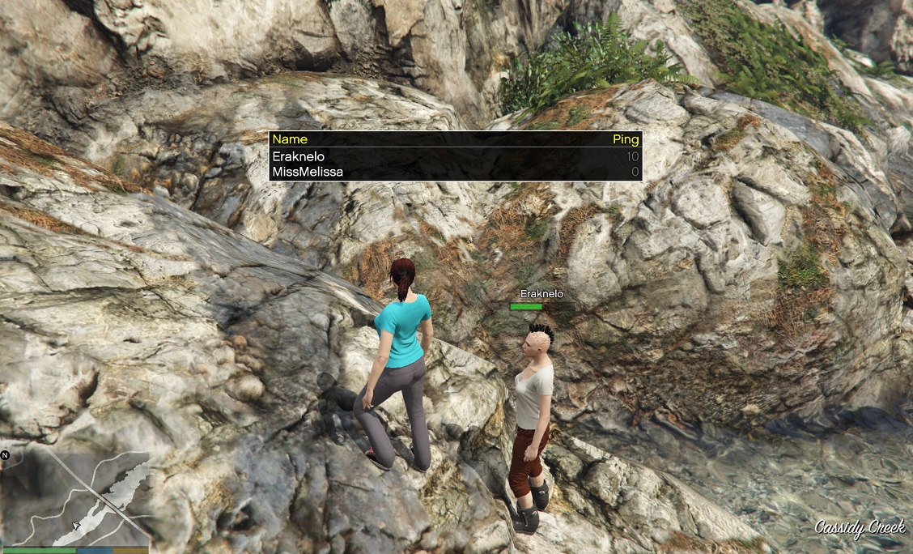
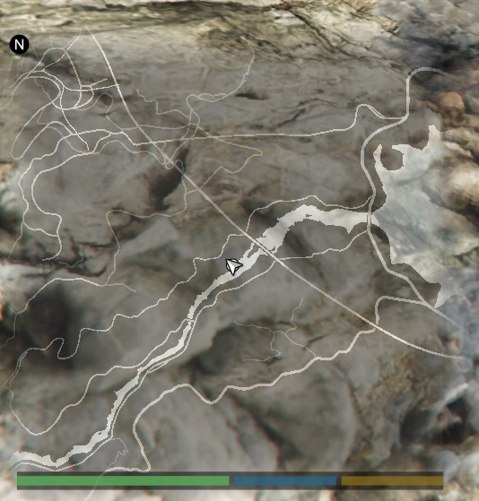
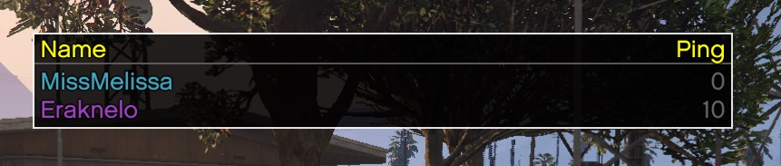

# playerlist-pro

Playerlist resource for GTA Network servers that gives a good-looking playerlist synchronized with the server. Also gives players the big map like in GTAO.





If you have [`colorednames`](https://github.com/MissyMelissa/colorednames) installed, the names in the playerlist will automatically be colored as well:



## Usage

Just install it and press the multiplayer info button. (On keyboard, this is Z by default.)

## Installation

Put the repository as a folder in the `resources` folder and then include it in your config like this:

```XML
<resource src="playerlist-pro" />
```

Or start it via the admin resource via: `/start playerlist-pro`
